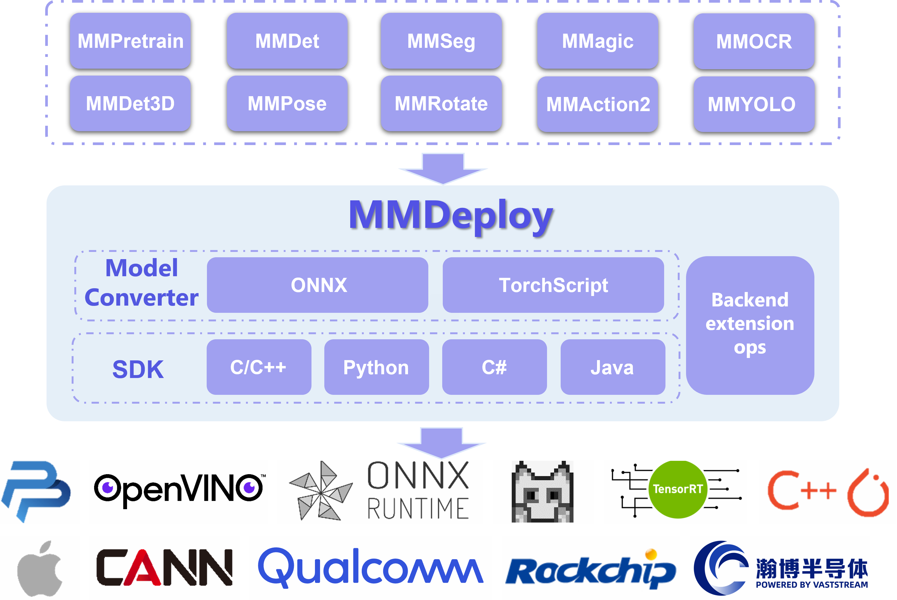
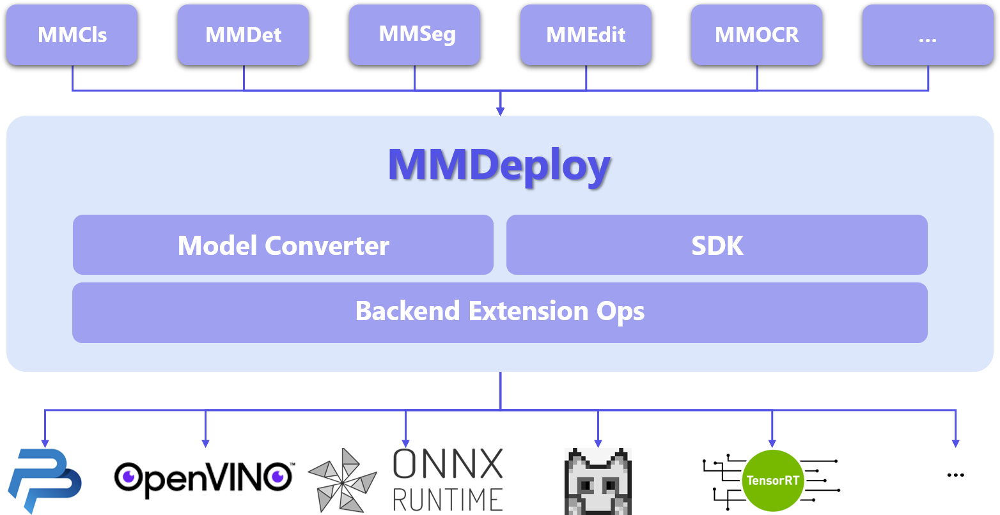

<div align="center">
  
  <div>&nbsp;</div>
  <div align="center">
    <b><font size="5">OpenMMLab website</font></b>
    <sup>
        <a href="https://openmmlab.com">
        <i><font size="4">HOT</font></i>
      </a>
    </sup>
    &nbsp;&nbsp;&nbsp;&nbsp;
    <b><font size="5">OpenMMLab platform</font></b>
    <sup>
      <a href="https://platform.openmmlab.com">
        <i><font size="4">TRY IT OUT</font></i>
      </a>
    </sup>
  </div>
  <div>&nbsp;</div>
</div>

[](https://mmdeploy.readthedocs.io/en/latest/)
[](https://github.com/open-mmlab/mmdeploy/actions)
[](https://codecov.io/gh/open-mmlab/mmdeploy)
[](https://github.com/open-mmlab/mmdeploy/blob/master/LICENSE)
[](https://github.com/open-mmlab/mmdeploy/issues)
[](https://github.com/open-mmlab/mmdeploy/issues)

English | [简体中文](README_zh-CN.md)

## Introduction

MMDeploy is an open-source deep learning model deployment toolset. It is a part of the [OpenMMLab](https://openmmlab.com/) project.

<div align="center">
  
</div>

## Main features

### Fully support OpenMMLab models

The currently supported codebases and models are as follows, and more will be included in the future

- [mmcls](docs/en/04-supported-codebases/mmcls.md)
- [mmdet](docs/en/04-supported-codebases/mmdet.md)
- [mmseg](docs/en/04-supported-codebases/mmseg.md)
- [mmedit](docs/en/04-supported-codebases/mmedit.md)
- [mmocr](docs/en/04-supported-codebases/mmocr.md)
- [mmpose](docs/en/04-supported-codebases/mmpose.md)
- [mmdet3d](docs/en/04-supported-codebases/mmdet3d.md)
- [mmrotate](docs/en/04-supported-codebases/mmrotate.md)

### Multiple inference backends are available

The supported Device-Platform-InferenceBackend matrix is presented as following, and more will be compatible.

The benchmark can be found from [here](docs/en/03-benchmark/benchmark.md)

| Device / Platform | Linux                                                           | Windows                                 | macOS    | Android          |
| ----------------- | --------------------------------------------------------------- | --------------------------------------- | -------- | ---------------- |
| x86_64 CPU        | ✔️ONNX Runtime<br>✔️pplnn<br>✔️ncnn<br>✔️OpenVINO<br>✔️LibTorch | ✔️ONNX Runtime<br>✔️OpenVINO            | -        | -                |
| ARM CPU           | ✔️ncnn                                                          | -                                       | -        | ✔️ncnn           |
| RISC-V            | ✔️ncnn                                                          | -                                       | -        | -                |
| NVIDIA GPU        | ✔️ONNX Runtime<br>✔️TensorRT<br>✔️pplnn<br>✔️LibTorch           | ✔️ONNX Runtime<br>✔️TensorRT<br>✔️pplnn | -        | -                |
| NVIDIA Jetson     | ✔️TensorRT                                                      | ✔️TensorRT                              | -        | -                |
| Huawei ascend310  | ✔️CANN                                                          | -                                       | -        | -                |
| Rockchip          | ✔️RKNN                                                          | -                                       | -        | -                |
| Apple M1          | -                                                               | -                                       | ✔️CoreML | -                |
| Adreno GPU        | -                                                               | -                                       | -        | ✔️ncnn<br>✔️SNPE |
| Hexagon DSP       | -                                                               | -                                       | -        | ✔️SNPE           |

### Efficient and scalable C/C++ SDK Framework

All kinds of modules in the SDK can be extended, such as `Transform` for image processing, `Net` for Neural Network inference, `Module` for postprocessing and so on

## [Documentation](https://mmdeploy.readthedocs.io/en/latest/)

Please read [getting_started](docs/en/get_started.md) for the basic usage of MMDeploy. We also provide tutoials about:

- [Build](docs/en/01-how-to-build/build_from_source.md)
  - [Build from Docker](docs/en/01-how-to-build/build_from_docker.md)
  - [Build from Script](docs/en/01-how-to-build/build_from_script.md)
  - [Build for Linux](docs/en/01-how-to-build/linux-x86_64.md)
  - [Build for macOS](docs/en/01-how-to-build/macos-arm64.md)
  - [Build for Win10](docs/en/01-how-to-build/windows.md)
  - [Build for Android](docs/en/01-how-to-build/android.md)
  - [Build for Jetson](docs/en/01-how-to-build/jetsons.md)
  - [Build for SNPE](docs/en/01-how-to-build/snpe.md)
  - [Cross Build for aarch64](docs/en/01-how-to-build/cross_build_ncnn_aarch64.md)
- User Guide
  - [How to convert model](docs/en/02-how-to-run/convert_model.md)
  - [How to write config](docs/en/02-how-to-run/write_config.md)
  - [How to profile model](docs/en/02-how-to-run/profile_model.md)
  - [How to quantize model](docs/en/02-how-to-run/quantize_model.md)
  - [Useful tools](docs/en/02-how-to-run/useful_tools.md)
- Developer Guide
  - [Architecture](docs/en/07-developer-guide/architecture.md)
  - [How to support new models](docs/en/07-developer-guide/support_new_model.md)
  - [How to support new backends](docs/en/07-developer-guide/support_new_backend.md)
  - [How to partition model](docs/en/07-developer-guide/partition_model.md)
  - [How to test rewritten model](docs/en/07-developer-guide/test_rewritten_models.md)
  - [How to test backend ops](docs/en/07-developer-guide/add_backend_ops_unittest.md)
  - [How to do regression test](docs/en/07-developer-guide/regression_test.md)
- Custom Backend Ops
  - [ncnn](docs/en/06-custom-ops/ncnn.md)
  - [onnxruntime](docs/en/06-custom-ops/onnxruntime.md)
  - [tensorrt](docs/en/06-custom-ops/tensorrt.md)
- [FAQ](docs/en/faq.md)
- [Contributing](.github/CONTRIBUTING.md)

## Benchmark and Model zoo

You can find the supported models from [here](docs/en/03-benchmark/supported_models.md) and their performance in the [benchmark](docs/en/03-benchmark/benchmark.md).

## Contributing

We appreciate all contributions to MMDeploy. Please refer to [CONTRIBUTING.md](.github/CONTRIBUTING.md) for the contributing guideline.

## Acknowledgement

We would like to sincerely thank the following teams for their contributions to [MMDeploy](https://github.com/open-mmlab/mmdeploy):

- [OpenPPL](https://github.com/openppl-public)
- [OpenVINO](https://github.com/openvinotoolkit/openvino)
- [ncnn](https://github.com/Tencent/ncnn)

## Citation

If you find this project useful in your research, please consider citing:

```BibTeX
@misc{=mmdeploy,
    title={OpenMMLab's Model Deployment Toolbox.},
    author={MMDeploy Contributors},
    howpublished = {\url{https://github.com/open-mmlab/mmdeploy}},
    year={2021}
}
```

## License

This project is released under the [Apache 2.0 license](LICENSE).

## Projects in OpenMMLab

- [MMCV](https://github.com/open-mmlab/mmcv): OpenMMLab foundational library for computer vision.
- [MIM](https://github.com/open-mmlab/mim): MIM installs OpenMMLab packages.
- [MMClassification](https://github.com/open-mmlab/mmclassification): OpenMMLab image classification toolbox and benchmark.
- [MMDetection](https://github.com/open-mmlab/mmdetection): OpenMMLab detection toolbox and benchmark.
- [MMDetection3D](https://github.com/open-mmlab/mmdetection3d): OpenMMLab's next-generation platform for general 3D object detection.
- [MMYOLO](https://github.com/open-mmlab/mmyolo): OpenMMLab YOLO series toolbox and benchmark
- [MMRotate](https://github.com/open-mmlab/mmrotate): OpenMMLab rotated object detection toolbox and benchmark.
- [MMSegmentation](https://github.com/open-mmlab/mmsegmentation): OpenMMLab semantic segmentation toolbox and benchmark.
- [MMOCR](https://github.com/open-mmlab/mmocr): OpenMMLab text detection, recognition, and understanding toolbox.
- [MMPose](https://github.com/open-mmlab/mmpose): OpenMMLab pose estimation toolbox and benchmark.
- [MMHuman3D](https://github.com/open-mmlab/mmhuman3d): OpenMMLab 3D human parametric model toolbox and benchmark.
- [MMSelfSup](https://github.com/open-mmlab/mmselfsup): OpenMMLab self-supervised learning toolbox and benchmark.
- [MMRazor](https://github.com/open-mmlab/mmrazor): OpenMMLab model compression toolbox and benchmark.
- [MMFewShot](https://github.com/open-mmlab/mmfewshot): OpenMMLab fewshot learning toolbox and benchmark.
- [MMAction2](https://github.com/open-mmlab/mmaction2): OpenMMLab's next-generation action understanding toolbox and benchmark.
- [MMTracking](https://github.com/open-mmlab/mmtracking): OpenMMLab video perception toolbox and benchmark.
- [MMFlow](https://github.com/open-mmlab/mmflow): OpenMMLab optical flow toolbox and benchmark.
- [MMEditing](https://github.com/open-mmlab/mmediting): OpenMMLab image and video editing toolbox.
- [MMGeneration](https://github.com/open-mmlab/mmgeneration): OpenMMLab image and video generative models toolbox.
- [MMDeploy](https://github.com/open-mmlab/mmdeploy): OpenMMLab model deployment framework.
