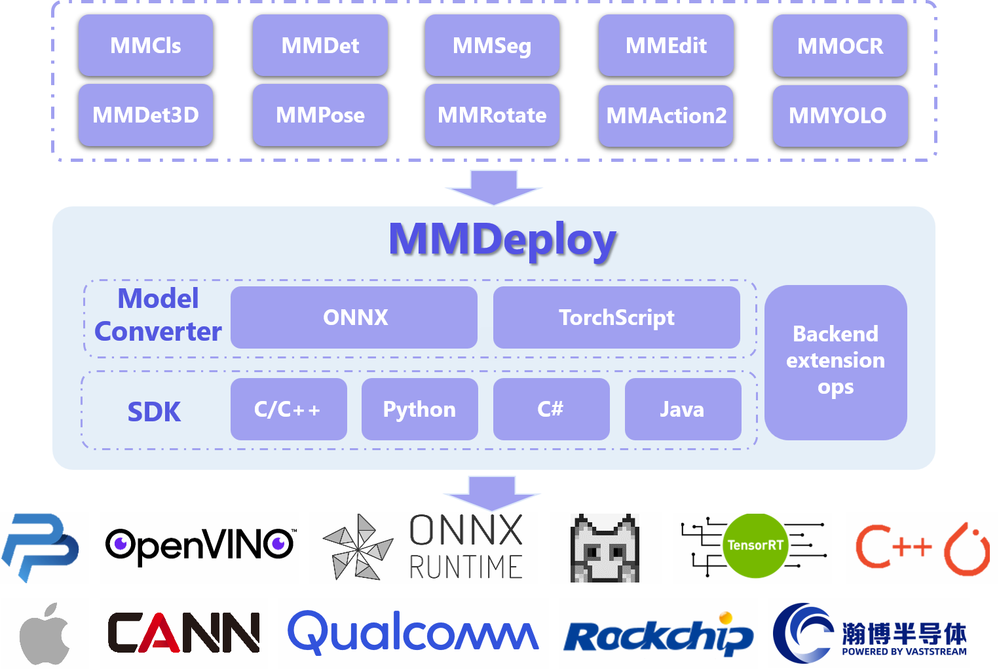

<div align="center">
  
  <div>&nbsp;</div>
  <div align="center">
    <b><font size="5">OpenMMLab 官网</font></b>
    <sup>
      <a href="https://openmmlab.com">
        <i><font size="4">HOT</font></i>
      </a>
    </sup>
    &nbsp;&nbsp;&nbsp;&nbsp;
    <b><font size="5">OpenMMLab 开放平台</font></b>
    <sup>
      <a href="https://platform.openmmlab.com">
        <i><font size="4">TRY IT OUT</font></i>
      </a>
    </sup>
  </div>
  <div>&nbsp;</div>
</div>

[](https://mmdeploy.readthedocs.io/zh_CN/latest/)
[](https://github.com/open-mmlab/mmdeploy/actions)
[](https://codecov.io/gh/open-mmlab/mmdeploy)
[](https://github.com/open-mmlab/mmdeploy/tree/main/LICENSE)
[](https://github.com/open-mmlab/mmdeploy/issues)
[](https://github.com/open-mmlab/mmdeploy/issues)

[English](README.md) | 简体中文

## MMDeploy 1.x 版本

全新的 MMDeploy 1.x 已发布，该版本适配OpenMMLab 2.0 生态体系，使用时务必**对齐版本**。
MMDeploy 代码库默认分支从`master`切换至`main`。 MMDeploy 0.x (`master`)将逐步废弃，新特性将只添加到 MMDeploy 1.x (`main`)。

| mmdeploy | mmengine |   mmcv   |  mmdet   | mmpretrain and others |
| :------: | :------: | :------: | :------: | :-------------------: |
|  0.x.y   |    -     | \<=1.x.y | \<=2.x.y |         0.x.y         |
|  1.x.y   |  0.x.y   |  2.x.y   |  3.x.y   |         1.x.y         |

[硬件模型库](https://platform.openmmlab.com/deploee/) 使用 MMDeploy 1.x 版本转换了 2300 个 onnx/ncnn/trt/openvino 模型，可免费搜索下载。系统内置真实的服务端/嵌入式硬件，用户可以在线完成模型转和速度测试。

## 介绍

MMDeploy 是 [OpenMMLab](https://openmmlab.com/) 模型部署工具箱，**为各算法库提供统一的部署体验**。基于 MMDeploy，开发者可以轻松从训练 repo 生成指定硬件所需 SDK，省去大量适配时间。

## 架构简析

<div align="center">
  
</div>

## 特性简介

### 支持超多 OpenMMLab 算法库

- [mmpretrain](docs/zh_cn/04-supported-codebases/mmpretrain.md)
- [mmdet](docs/zh_cn/04-supported-codebases/mmdet.md)
- [mmseg](docs/zh_cn/04-supported-codebases/mmseg.md)
- [mmagic](docs/zh_cn/04-supported-codebases/mmagic.md)
- [mmocr](docs/zh_cn/04-supported-codebases/mmocr.md)
- [mmpose](docs/zh_cn/04-supported-codebases/mmpose.md)
- [mmdet3d](docs/zh_cn/04-supported-codebases/mmdet3d.md)
- [mmrotate](docs/zh_cn/04-supported-codebases/mmrotate.md)
- [mmaction2](docs/zh_cn/04-supported-codebases/mmaction2.md)

### 支持多种推理后端

支持的设备平台和推理引擎如下表所示。benchmark请参考[这里](docs/zh_cn/03-benchmark/benchmark.md)

<div style="width: fit-content; margin: auto;">
<table>
  <tr>
    <th>Device / <br> Platform</th>
    <th>Linux</th>
    <th>Windows</th>
    <th>macOS</th>
    <th>Android</th>
  </tr>
  <tr>
    <th>x86_64 <br> CPU</th>
    <td>
        <sub><a href="https://github.com/open-mmlab/mmdeploy/actions/workflows/backend-ort.yml"></a></sub> <sub>onnxruntime</sub> <br>
        <sub><a href="https://github.com/open-mmlab/mmdeploy/actions/workflows/backend-pplnn.yml"></a></sub> <sub>pplnn</sub> <br>
        <sub><a href="https://github.com/open-mmlab/mmdeploy/actions/workflows/backend-ncnn.yml"></a></sub> <sub>ncnn</sub> <br>
        <sub><a href="https://github.com/open-mmlab/mmdeploy/actions/workflows/backend-torchscript.yml"></a></sub> <sub>LibTorch</sub> <br>
        <sub></sub> <sub>OpenVINO</sub> <br>
        <sub></sub> <sub>TVM</sub> <br>
    </td>
    <td>
        <sub></sub> <sub>onnxruntime</sub> <br>
        <sub></sub> <sub>OpenVINO</sub> <br>
        <sub></sub> <sub>ncnn</sub> <br>
    </td>
    <td align="center">
        -
    </td>
    <td align="center">
        -
    </td>
  </tr>

<tr>
    <th>ARM <br> CPU</th>
    <td>
        <sub><a href="https://github.com/open-mmlab/mmdeploy/actions/workflows/build.yml"></a></sub> <sub>ncnn</sub> <br>
    </td>
    <td align="center">
        -
    </td>
    <td align="center">
        -
    </td>
    <td align="center">
        <sub><a href="https://github.com/open-mmlab/mmdeploy/actions/workflows/backend-ncnn.yml"></a></sub> <sub>ncnn</sub> <br>
    </td>
  </tr>

<tr>
    <th>RISC-V</th>
    <td>
        <sub><a href="https://github.com/open-mmlab/mmdeploy/actions/workflows/linux-riscv64-gcc.yml"></a></sub> <sub>ncnn</sub> <br>
    </td>
    <td align="center">
        -
    </td>
    <td align="center">
        -
    </td>
    <td align="center">
        -
    </td>
  </tr>

<tr>
    <th>NVIDIA <br> GPU</th>
    <td>
        <sub><a href="https://github.com/open-mmlab/mmdeploy/actions/workflows/build.yml"></a></sub> <sub>onnxruntime</sub> <br>
        <sub><a href="https://github.com/open-mmlab/mmdeploy/actions/workflows/build.yml"></a></sub> <sub>TensorRT</sub> <br>
        <sub></sub> <sub>LibTorch</sub> <br>
        <sub><a href="https://github.com/open-mmlab/mmdeploy/actions/workflows/backend-pplnn.yml"></a></sub> <sub>pplnn</sub> <br>
    </td>
    <td>
        <sub><a href="https://github.com/open-mmlab/mmdeploy/actions/workflows/build.yml"></a></sub> <sub>onnxruntime</sub> <br>
        <sub><a href="https://github.com/open-mmlab/mmdeploy/actions/workflows/build.yml"></a></sub> <sub>TensorRT</sub> <br>
    </td>
    <td align="center">
        -
    </td>
    <td align="center">
        -
    </td>
  </tr>

<tr>
    <th>NVIDIA <br> Jetson</th>
    <td>
        <sub></sub> <sub>TensorRT</sub> <br>
    </td>
    <td align="center">
        -
    </td>
    <td align="center">
        -
    </td>
    <td align="center">
        -
    </td>
  </tr>

<tr>
    <th>Huawei <br> ascend310</th>
    <td>
        <sub><a href="https://github.com/open-mmlab/mmdeploy/actions/workflows/backend-ascend.yml"></a></sub> <sub>CANN</sub> <br>
    </td>
    <td align="center">
        -
    </td>
    <td align="center">
        -
    </td>
    <td align="center">
        -
    </td>
  </tr>

<tr>
    <th>Rockchip</th>
    <td>
        <sub><a href="https://github.com/open-mmlab/mmdeploy/actions/workflows/backend-rknn.yml"></a></sub> <sub>RKNN</sub> <br>
    </td>
    <td align="center">
        -
    </td>
    <td align="center">
        -
    </td>
    <td align="center">
        -
    </td>
  </tr>

<tr>
    <th>Apple M1</th>
    <td align="center">
        -
    </td>
    <td align="center">
        -
    </td>
    <td>
        <sub><a href="https://github.com/open-mmlab/mmdeploy/actions/workflows/backend-coreml.yml"></a></sub> <sub>CoreML</sub> <br>
    </td>
    <td align="center">
        -
    </td>
  </tr>

<tr>
    <th>Adreno <br> GPU</th>
    <td align="center">
        -
    </td>
    <td align="center">
        -
    </td>
    <td align="center">
        -
    </td>
    <td>
        <sub><a href="https://github.com/open-mmlab/mmdeploy/actions/workflows/backend-snpe.yml"></a></sub> <sub>SNPE</sub> <br>
        <sub><a href="https://github.com/open-mmlab/mmdeploy/actions/workflows/backend-ncnn.yml"></a></sub> <sub>ncnn</sub> <br>
    </td>
  </tr>

<tr>
    <th>Hexagon <br> DSP</th>
    <td align="center">
        -
    </td>
    <td align="center">
        -
    </td>
    <td align="center">
        -
    </td>
    <td>
        <sub><a href="https://github.com/open-mmlab/mmdeploy/actions/workflows/backend-snpe.yml"></a></sub> <sub>SNPE</sub> <br>
    </td>
  </tr>
</table>
</div>

### SDK 可高度定制化

- Transform 数据预处理
- Net 推理
- Module 后处理

## [中文文档](https://mmdeploy.readthedocs.io/zh_CN/latest/)

- [快速上手](docs/zh_cn/get_started.md)
- [编译](docs/zh_cn/01-how-to-build/build_from_source.md)
  - [一键式脚本安装](docs/zh_cn/01-how-to-build/build_from_script.md)
  - [Build from Docker](docs/zh_cn/01-how-to-build/build_from_docker.md)
  - [Build for Linux](docs/zh_cn/01-how-to-build/linux-x86_64.md)
  - [Build for macOS](docs/zh_cn/01-how-to-build/macos-arm64.md)
  - [Build for Win10](docs/zh_cn/01-how-to-build/windows.md)
  - [Build for Android](docs/zh_cn/01-how-to-build/android.md)
  - [Build for Jetson](docs/zh_cn/01-how-to-build/jetsons.md)
  - [Build for SNPE](docs/zh_cn/01-how-to-build/snpe.md)
  - [Cross Build for aarch64](docs/zh_cn/01-how-to-build/cross_build_ncnn_aarch64.md)
- 使用
  - [把模型转换到推理 Backend](docs/zh_cn/02-how-to-run/convert_model.md)
  - [配置转换参数](docs/zh_cn/02-how-to-run/write_config.md)
  - [量化](docs/zh_cn/02-how-to-run/quantize_model.md)
  - [测试转换完成的模型](docs/zh_cn/02-how-to-run/profile_model.md)
  - [工具集介绍](docs/zh_cn/02-how-to-run/useful_tools.md)
- 开发指南
  - [软件架构](docs/zh_cn/07-developer-guide/architecture.md)
  - [支持新模型](docs/zh_cn/07-developer-guide/support_new_model.md)
  - [增加推理 backend](docs/zh_cn/07-developer-guide/support_new_backend.md)
  - [模型分块](docs/zh_cn/07-developer-guide/partition_model.md)
  - [测试重写模型](docs/zh_cn/07-developer-guide/test_rewritten_models.md)
  - [backend 算子测试](docs/zh_cn/07-developer-guide/add_backend_ops_unittest.md)
  - [回归测试](docs/zh_cn/07-developer-guide/regression_test.md)
- 各 backend 自定义算子列表
  - [ncnn](docs/zh_cn/06-custom-ops/ncnn.md)
  - [onnxruntime](docs/zh_cn/06-custom-ops/onnxruntime.md)
  - [tensorrt](docs/zh_cn/06-custom-ops/tensorrt.md)
- [FAQ](docs/zh_cn/faq.md)
- [贡献者手册](.github/CONTRIBUTING.md)

## 新人解说

- [01 术语解释、加载第一个模型](docs/zh_cn/tutorial/01_introduction_to_model_deployment.md)
- [02 部署常见问题](docs/zh_cn/tutorial/02_challenges.md)
- [03 torch转onnx](docs/zh_cn/tutorial/03_pytorch2onnx.md)
- [04 让torch支持更多onnx算子](docs/zh_cn/tutorial/04_onnx_custom_op.md)
- [05 调试onnx模型](docs/zh_cn/tutorial/05_onnx_model_editing.md)

## 基准与模型库

基准和支持的模型列表可以在[基准](https://mmdeploy.readthedocs.io/zh_CN/latest/03-benchmark/benchmark.html)和[模型列表](https://mmdeploy.readthedocs.io/en/latest/03-benchmark/supported_models.html)中获得。

## 贡献指南

我们感谢所有的贡献者为改进和提升 MMDeploy 所作出的努力。请参考[贡献指南](.github/CONTRIBUTING.md)来了解参与项目贡献的相关指引。

## 致谢

- [OpenPPL](https://github.com/openppl-public/ppl.nn): 高性能推理框架底层库
- [OpenVINO](https://github.com/openvinotoolkit/openvino): AI 推理优化和部署框架
- [ncnn](https://github.com/tencent/ncnn): 为手机端极致优化的高性能神经网络前向计算框架

## 引用

如果您在研究中使用了本项目的代码或者性能基准，请参考如下 bibtex 引用 MMDeploy:

```BibTeX
@misc{=mmdeploy,
    title={OpenMMLab's Model Deployment Toolbox.},
    author={MMDeploy Contributors},
    howpublished = {\url{https://github.com/open-mmlab/mmdeploy}},
    year={2021}
}
```

## 开源许可证

该项目采用 [Apache 2.0 开源许可证](LICENSE)。

## OpenMMLab 的其他项目

- [MMEngine](https://github.com/open-mmlab/mmengine): OpenMMLab 深度学习模型训练基础库
- [MMCV](https://github.com/open-mmlab/mmcv): OpenMMLab 计算机视觉基础库
- [MMPretrain](https://github.com/open-mmlab/mmpretrain): OpenMMLab 深度学习预训练工具箱
- [MMagic](https://github.com/open-mmlab/mmagic): OpenMMLab 新一代人工智能内容生成（AIGC）工具箱
- [MMDetection](https://github.com/open-mmlab/mmdetection): OpenMMLab 目标检测工具箱
- [MMDetection3D](https://github.com/open-mmlab/mmdetection3d): OpenMMLab 新一代通用 3D 目标检测平台
- [MMYOLO](https://github.com/open-mmlab/mmyolo): OpenMMLab YOLO 系列工具箱和基准测试
- [MMRotate](https://github.com/open-mmlab/mmrotate): OpenMMLab 旋转框检测工具箱与测试基准
- [MMTracking](https://github.com/open-mmlab/mmtracking): OpenMMLab 一体化视频目标感知平台
- [MMSegmentation](https://github.com/open-mmlab/mmsegmentation): OpenMMLab 语义分割工具箱
- [MMOCR](https://github.com/open-mmlab/mmocr): OpenMMLab 全流程文字检测识别理解工具包
- [MMPose](https://github.com/open-mmlab/mmpose): OpenMMLab 姿态估计工具箱
- [MMHuman3D](https://github.com/open-mmlab/mmhuman3d): OpenMMLab 人体参数化模型工具箱与测试基准
- [MMFewShot](https://github.com/open-mmlab/mmfewshot): OpenMMLab 少样本学习工具箱与测试基准
- [MMAction2](https://github.com/open-mmlab/mmaction2): OpenMMLab 新一代视频理解工具箱
- [MMFlow](https://github.com/open-mmlab/mmflow): OpenMMLab 光流估计工具箱与测试基准
- [MMDeploy](https://github.com/open-mmlab/mmdeploy): OpenMMLab 模型部署框架
- [MMRazor](https://github.com/open-mmlab/mmrazor): OpenMMLab 模型压缩工具箱与测试基准
- [MIM](https://github.com/open-mmlab/mim): OpenMMlab 项目、算法、模型的统一入口
- [Playground](https://github.com/open-mmlab/playground): 收集和展示 OpenMMLab 相关的前沿、有趣的社区项目

## 欢迎加入 OpenMMLab 社区

扫描下方的二维码可关注 OpenMMLab 团队的 [知乎官方账号](https://www.zhihu.com/people/openmmlab)，扫描下方微信二维码添加喵喵好友，进入 MMDeploy 微信交流社群。【加好友申请格式：研究方向+地区+学校/公司+姓名】

<div align="center">
  
  
</div>

我们会在 OpenMMLab 社区为大家

- 📢 分享 AI 框架的前沿核心技术
- 💻 解读 PyTorch 常用模块源码
- 📰 发布 OpenMMLab 的相关新闻
- 🚀 介绍 OpenMMLab 开发的前沿算法
- 🏃 获取更高效的问题答疑和意见反馈
- 🔥 提供与各行各业开发者充分交流的平台

干货满满 📘，等您来撩 💗，OpenMMLab 社区期待您的加入 👬
