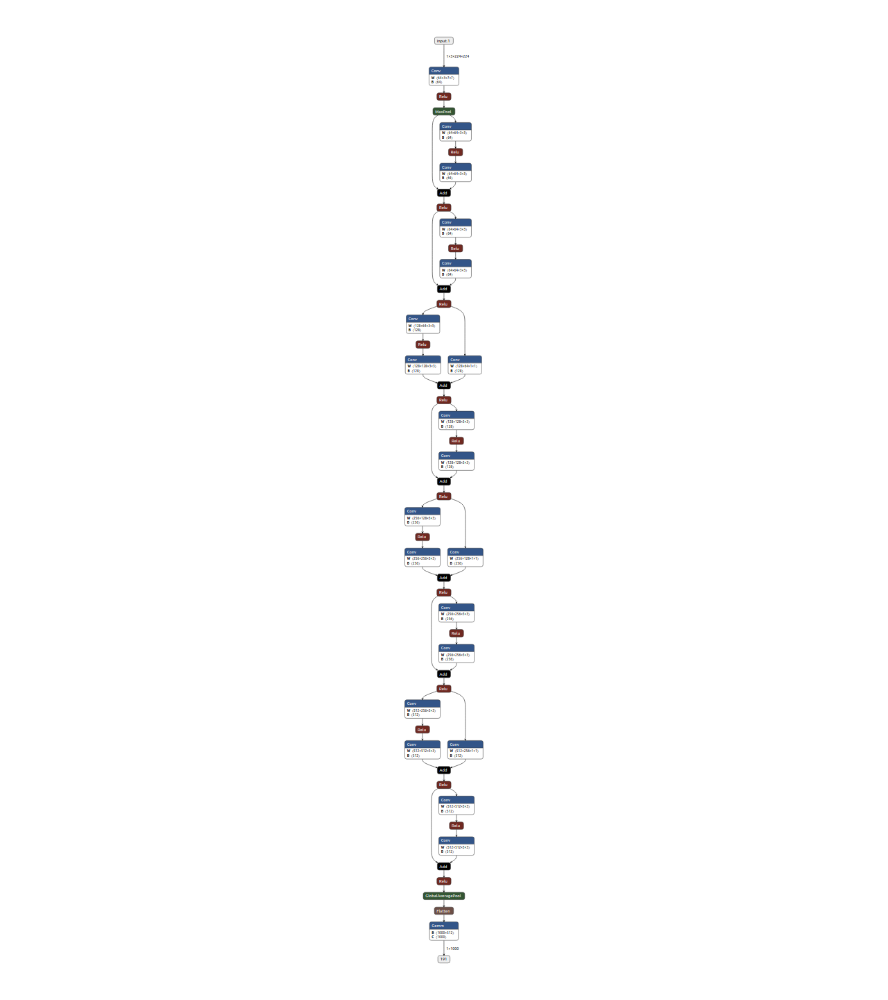
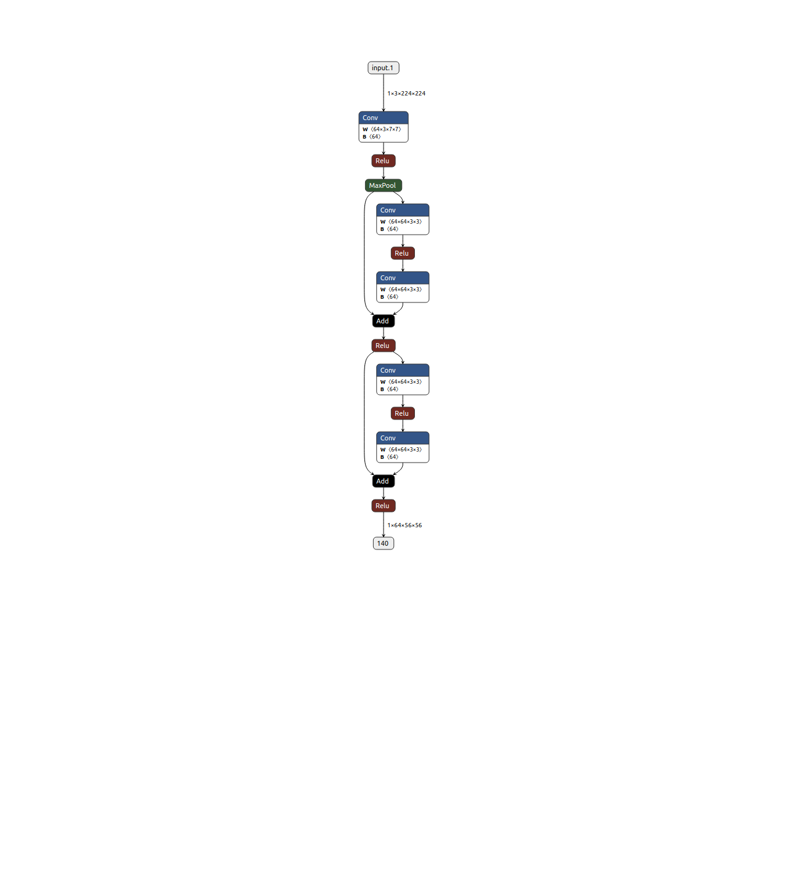

## Demo

We provide a demo showing what our mmdeploy can do for general model deployment.

In `demo_rewrite.py`, a resnet18 model from `torchvision` is rewritten through mmdeploy tool. In our rewritten model, the forward function of resnet gets modified to only down sample the original input to 4x. Original onnx model of resnet18 and its rewritten are visualized through [netron](https://netron.app/).

### Prerequisite

Before we run `demp_rewrite.py`, we need to install `pyppeteer` through:

```
pip install pyppeteer
```

### Demo results

The original resnet18 model and its modified one are visualized as follows. The left model is the original resnet18 while the right model is exported after rewritten.

|      Original resnet18      |       Rewritten model        |
| :-------------------------: | :--------------------------: |
|  |  |
