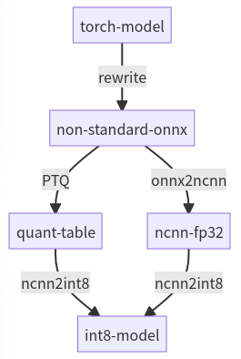

# Quantize model

## Why quantization ?

The fixed-point model has many advantages over the fp32 model:

- Smaller size, 8-bit model reduces file size by 75%
- Benefit from the smaller model, the Cache hit rate is improved and inference would be faster
- Chips tend to have corresponding fixed-point acceleration instructions which are faster and less energy consumed (int8 on a common CPU requires only about 10% of energy)

APK file size and heat generation are key indicators while evaluating mobile APP;
On server side, quantization means that you can increase model size in exchange for precision and keep the same QPS.

## Post training quantization scheme

Taking ncnn backend as an example, the complete workflow is as follows:

<div align="center">
  
</div>

mmdeploy generates quantization table based on static graph (onnx) and uses backend tools to convert fp32 model to fixed point.

mmdeploy currently support ncnn with PTQ.

## How to convert model

[After mmdeploy installation](../01-how-to-build/build_from_source.md), install ppq

```bash
git clone https://github.com/openppl-public/ppq.git
cd ppq
pip install -r requirements.txt
python3 setup.py install
```

Back in mmdeploy, enable quantization with the option 'tools/deploy.py --quant'.

```bash
cd /path/to/mmdeploy

export MODEL_CONFIG=/home/rg/konghuanjun/mmclassification/configs/resnet/resnet18_8xb32_in1k.py
export MODEL_PATH=https://download.openmmlab.com/mmclassification/v0/resnet/resnet18_8xb32_in1k_20210831-fbbb1da6.pth

# get some imagenet sample images
git clone https://github.com/nihui/imagenet-sample-images --depth=1

# quantize
python3 tools/deploy.py  configs/mmcls/classification_ncnn-int8_static.py  ${MODEL_CONFIG}  ${MODEL_PATH}   /path/to/self-test.png   --work-dir work_dir --device cpu --quant --quant-image-dir /path/to/imagenet-sample-images
...
```

Description

|     Parameter     |                             Meaning                              |
| :---------------: | :--------------------------------------------------------------: |
|      --quant      |         Enable quantization, the default value is False          |
| --quant-image-dir | Calibrate dataset, use Validation Set in MODEL_CONFIG by default |

## Custom calibration dataset

Calibration set is used to calculate quantization layer parameters. Some DFQ (Data Free Quantization) methods do not even require a dataset.

- Create a folder, just put in some images (no directory structure, no negative example, no special filename format)
- The image needs to be the data comes from real scenario otherwise the accuracy would be drop
- You can not quantize model with test dataset
  | Type  | Train dataset | Validation dataset | Test dataset  | Calibration dataset |
  | ----- | ------------- | ------------------ | ------------- | ------------------- |
  | Usage | QAT           | PTQ                | Test accuracy | PTQ                 |

It is highly recommended that [verifying model precision](profile_model.md) after quantization. [Here](../03-benchmark/quantization.md) is some quantization model test result.
