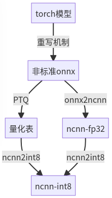

# 如何量化模型

## 为什么要量化

相对于 fp32 模型，定点模型有诸多优点：

- 体积更小，8-bit 模型可降低 75% 文件大小
- 由于模型变小，Cache 命中率提升，速度更快
- 芯片往往有对应的定点加速指令，这些指令更快、能耗更低（常见 CPU 上 int8 大约只需要 10% 能量）

安装包体积、发热都是移动端评价 APP 的关键指标；而在服务端，“加速”意味着可以维持相同 QPS、增大模型换取精度提升。

## mmdeploy 离线量化方案

以 ncnn backend 为例，完整的工作流如下：

<div align="center">
  
</div>

mmdeploy 基于静态图（onnx）生成推理框架所需的量化表，再用后端工具把浮点模型转为定点。

目前 mmdeploy 支持 ncnn PTQ。

## 模型怎么转定点

[mmdeploy 安装](../01-how-to-build/build_from_source.md)完成后，加载 ppq 并安装

```bash
git clone https://github.com/openppl-public/ppq.git
cd ppq
pip install -r requirements.txt
python3 setup.py install
```

回到 mmdeploy, 使用 `tools/deploy.py --quant` 选项开启量化。

```bash
cd /path/to/mmdeploy
export MODEL_CONFIG=/path/to/mmpretrain/configs/resnet/resnet18_8xb16_cifar10.py
export MODEL_PATH=https://download.openmmlab.com/mmclassification/v0/resnet/resnet18_b16x8_cifar10_20210528-bd6371c8.pth

# 找一些 imagenet 样例图
git clone https://github.com/nihui/imagenet-sample-images --depth=1

# 量化模型
python3 tools/deploy.py  configs/mmpretrain/classification_ncnn-int8_static.py  ${MODEL_CONFIG}  ${MODEL_PATH}   /path/to/self-test.png   --work-dir work_dir --device cpu --quant --quant-image-dir /path/to/imagenet-sample-images
...
```

参数说明

|       参数        |                       含义                       |
| :---------------: | :----------------------------------------------: |
|      --quant      |            是否开启量化，默认为 False            |
| --quant-image-dir | 校准数据集，默认使用 MODEL_CONFIG 中的**验证集** |

## 自建校准数据集

校准集是用来计算量化层参数的，某些 DFQ（Data Free Quantization）方法甚至不需要校准集

- 新建文件夹，直接放入图片即可（不需要目录结构、不要负例、没有命名要求）
- 图片需为真实业务场景中的数据，相差过远会导致精度下降
- 不能直接拿测试集做量化，否则是过拟合
  | 类型 | 训练集 | 验证集 | 测试集   | 校准集 |
  | ---- | ------ | ------ | -------- | ------ |
  | 用法 | QAT    | PTQ    | 测试精度 | PTQ    |

**强烈建议**量化结束后，[按此文档](profile_model.md) 验证模型精度。[这里](../03-benchmark/quantization.md) 是一些量化模型测试结果。
