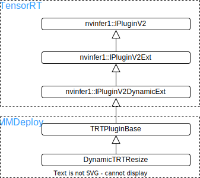

# 第七章： TensorRT 自定义插件

## 介绍

在前面的模型部署入门系列文章中，我们介绍了部署一个 PyTorch 模型到推理后端，如 ONNXRuntime，这其中可能遇到很多工程性的问题。

有些可以通过创建 ONNX 节点来解决，该节点仍然使用后端原生的实现进行推理。而有些无法导出到后端的算法，可以通过重写代码改变算法的实现过程，同样可以导出到 ONNX ，达到一致的效果。以上两种方式一般可以处理绝大多数的部署问题，同时也不需要向推理框架引入新的内容，是我们进行模型部署时候的优先选择。

然而，仍然存在部分模型，模型中某些算子无法通过上述两种方式绕过问题，这时候，如何对特定后端实现对应代码就极为重要。这也是本文将介绍的第三种方式——**自定义插件**。

自定义插件是很多推理框架支持用户自定义算子的方式，以 MMDeploy 为例，它是一个支持多种推理后端的算法库。目前支持的后端有：

- ONNXRuntime
- TensorRT
- ncnn
- openvino
- PPLNN
  其中，前三种后端均实现了一些自定义的算子。例如 ONNXRuntime 中的调制可变性卷积，ncnn 中的topk 算子，TensorRT 中的 MultiLevelRoiAlign 。

介绍如何给后端自定义算子是一件相对复杂的事情，所以本文只针对其中一种后端 TensorRT，介绍自定义算子。如果读者对其他后端感兴趣，可以去他们的代码库查看，一般地，各个推理框架均有详细文档介绍如何添加客制化的算子实现。

## 在MMDeploy添加TensorRT插件

仍然以前面[教程二](./02_challenges.md)中的超分辨模型SRCNN为例。在教程二中，我们用 ONNXRuntime 作为后端，通过 PyTorch 的 symbolic 函数导出了一个支持动态 scale 的 ONNX 模型，这个模型可以直接用 ONNXRuntime 运行，这是因为 `NewInterpolate` 类导出的节点 `Resize` 就是ONNXRuntime支持的节点。下面我们尝试直接将教程二导出的 `srcnn3.onnx` 转换到TensorRT。

```python
from mmdeploy.backend.tensorrt.utils import from_onnx

from_onnx(
    'srcnn3.onnx',
    'srcnn3',
    input_shapes=dict(
        input=dict(
            min_shape=[1, 3, 256, 256],
            opt_shape=[1, 3, 256, 256],
            max_shape=[1, 3, 256, 256]),
        factor=dict(
            min_shape=[4],
            opt_shape=[4],
            max_shape=[4])))
```

没有安装过MMDeploy的小伙伴可以先参考 [build](../01-how-to-build) 进行安装，安装完成后执行上述脚本，会有如下报错：

```shell
RuntimeError: Failed to parse onnx, In node 1 (importResize): UNSUPPORTED_NODE: Assertion failed: mode != "cubic" && "This version of TensorRT does not support cubic interpolation!"
```

报错的原因有以下两方面：

1. `srcnn3.onnx`文件中的 `Resize` 是 ONNX 原生节点。其插值方式之一 bicubic 并不被 TensorRT 支持（TensorRT 的 Resize Layer仅支持 nearest 和 bilinear 两种插值方式）。日志的错误信息也明确提示了这点；
2. 但即便将 "bicubic" 模式改为 "bilinear" ，转换仍然失败: `RuntimeError: Failed to parse onnx, In node 1 (importResize): UNSUPPORTED_NODE: Assertion failed: scales.is_weights() && Resize scales must be initializer!"`。这是因为 TensorRT 无法接受动态 scale 导致的。

### 创建ONNX节点

为解决上述问题，我们需要创建一个新的节点替换原生 Resize 节点，并且实现新节点对应的插件代码。

继续复用同样节点名的方式已经不可取，我们需要创建新的节点。改节点名称就叫 `Test::DynamicTRTResize`，这是种类C++的写法，`Test` 为域名，主要用于区分不同来源下的同名的节点，比如 `ONNX::` 和 `Test::`。当然了，ONNX本身也不存在 `DynamicTRTResize` 的节点名。

```python
import torch
from torch import nn
from torch.nn.functional import interpolate
import torch.onnx
import cv2
import numpy as np
import os, requests

# Download checkpoint and test image
urls = ['https://download.openmmlab.com/mmediting/restorers/srcnn/srcnn_x4k915_1x16_1000k_div2k_20200608-4186f232.pth',
    'https://raw.githubusercontent.com/open-mmlab/mmediting/master/tests/data/face/000001.png']
names = ['srcnn.pth', 'face.png']
for url, name in zip(urls, names):
    if not os.path.exists(name):
        open(name, 'wb').write(requests.get(url).content)

class DynamicTRTResize(torch.autograd.Function):

    def __init__(self) -> None:
        super().__init__()

    @staticmethod
    def symbolic(g, input, size_tensor, align_corners = False):
        """Symbolic function for creating onnx op."""
        return g.op(
            'Test::DynamicTRTResize',
            input,
            size_tensor,
            align_corners_i=align_corners)

    @staticmethod
    def forward(g, input, size_tensor, align_corners = False):
        """Run forward."""
        size = [size_tensor.size(-2), size_tensor.size(-1)]
        return interpolate(
            input, size=size, mode='bicubic', align_corners=align_corners)


class StrangeSuperResolutionNet(nn.Module):

    def __init__(self):
        super().__init__()

        self.conv1 = nn.Conv2d(3, 64, kernel_size=9, padding=4)
        self.conv2 = nn.Conv2d(64, 32, kernel_size=1, padding=0)
        self.conv3 = nn.Conv2d(32, 3, kernel_size=5, padding=2)

        self.relu = nn.ReLU()

    def forward(self, x, size_tensor):
        x = DynamicTRTResize.apply(x, size_tensor)
        out = self.relu(self.conv1(x))
        out = self.relu(self.conv2(out))
        out = self.conv3(out)
        return out


def init_torch_model():
    torch_model = StrangeSuperResolutionNet()

    state_dict = torch.load('srcnn.pth')['state_dict']

    # Adapt the checkpoint
    for old_key in list(state_dict.keys()):
        new_key = '.'.join(old_key.split('.')[1:])
        state_dict[new_key] = state_dict.pop(old_key)

    torch_model.load_state_dict(state_dict)
    torch_model.eval()
    return torch_model


model = init_torch_model()
factor = torch.rand([1, 1, 512, 512], dtype=torch.float)

input_img = cv2.imread('face.png').astype(np.float32)

# HWC to NCHW
input_img = np.transpose(input_img, [2, 0, 1])
input_img = np.expand_dims(input_img, 0)

# Inference
torch_output = model(torch.from_numpy(input_img), factor).detach().numpy()

# NCHW to HWC
torch_output = np.squeeze(torch_output, 0)
torch_output = np.clip(torch_output, 0, 255)
torch_output = np.transpose(torch_output, [1, 2, 0]).astype(np.uint8)

# Show image
cv2.imwrite("face_torch.png", torch_output)

x = torch.randn(1, 3, 256, 256)

dynamic_axes={
        'input': {
            0: 'batch',
            2: 'height',
            3: 'width'
        },
        'factor': {
            0: 'batch1',
            2: 'height1',
            3: 'width1'
        },
        'output': {
            0: 'batch2',
            2: 'height2',
            3: 'width2'
        },
    }

with torch.no_grad():
    torch.onnx.export(
        model, (x, factor),
        "srcnn3.onnx",
        opset_version=11,
        input_names=['input', 'factor'],
        output_names=['output'],
        dynamic_axes=dynamic_axes)
```

执行上述脚本，我们导出成功了一个ONNX模型 `srcnn.onnx`。用[netron](https://netron.app/)打开这个模型可视化如下：


直接将该模型转换成TensorRT模型也是不可行的，这是因为TensorRT还无法解析 `DynamicTRTResize` 节点。而想要解析该节点，我们必须为TensorRT添加c++代码，实现该插件。

### C++实现

因为MMDeploy中已经实现了Bicubic Interpolate算子，所以我们可以复用其中的CUDA部分代码，只针对TensorRT实现支持动态scale的插件即可。对CUDA编程感兴趣的小伙伴可以参考CUDA的[官方教程](https://docs.nvidia.com/cuda/cuda-c-programming-guide/index.html)。因为 `csrc/backend_ops/tensorrt/bicubic_interpolate` 中有我们需要的CUDA代码，所以我们可以直接在该文件夹加添加TensorRT相关的trt_dynamic_resize.hpp和trt_dynamic_resize.cpp文件，在这两个文件中分别声明和实现插件就可以了。我们也可以新建文件夹 `csrc/backend_ops/tensorrt/dynamic_resize`，将这两个文件直接放到这个文件夹下。

对TensorRT 7+，要实现这样一个自定义插件，我们需要写两个类。

- `DynamicTRTResize`，继承自[nvinfer1::IPluginV2DynamicExt](https://docs.nvidia.com/deeplearning/tensorrt/api/c_api/classnvinfer1_1_1_i_plugin_v2_dynamic_ext.html)，完成插件的具体实现
- `DynamicTRTResizeCreator`，继承自[nvinfer1::IPluginCreator](https://docs.nvidia.com/deeplearning/tensorrt/api/c_api/classnvinfer1_1_1_i_plugin_creator.html)，是插件的工厂类，用于创建`DynamicTRTResize`插件的实例。

在MMDeploy中，由于有若干插件需要实现，所以我们在`mmdeploy/csrc/backend_ops/tensorrt/common/trt_plugin_base.hpp`中实现了`TRTPluginBase`和`TRTPluginCreatorBase`两个类，用于管理一些所有插件共有的属性方法。其中，`TRTPluginBase`是继承自`nvinfer1::IPluginV2DynamicExt`，而`TRTPluginCreatorBase`是继承自`nvinfer1::IPluginCreator`。这样，用户实现插件时只需继承这两个新的类即可。所以我们只需在`dynamic_resize`文件夹下.hpp文件中，引用`trt_plugin_base.hpp`头文件，然后实现类如下：

```cpp
class DynamicTRTResize : public TRTPluginBase{}
class DynamicTRTResizeCreator : public TRTPluginCreatorBase{}
```

在trt_dynamic_resize.hpp中，我们声明如下内容：

```cpp
#ifndef TRT_DYNAMIC_RESIZE_HPP
#define TRT_DYNAMIC_RESIZE_HPP
#include <cublas_v2.h>

#include <memory>
#include <string>
#include <vector>

#include "trt_plugin_base.hpp"
namespace mmdeploy {
class DynamicTRTResize : public TRTPluginBase {
 public:
  DynamicTRTResize(const std::string &name, bool align_corners);

  DynamicTRTResize(const std::string name, const void *data, size_t length);

  DynamicTRTResize() = delete;

  // IPluginV2DynamicExt Methods
  nvinfer1::IPluginV2DynamicExt *clone() const TRT_NOEXCEPT override;
  nvinfer1::DimsExprs getOutputDimensions(int outputIndex, const nvinfer1::DimsExprs *inputs,
                                          int nbInputs, nvinfer1::IExprBuilder &exprBuilder)
      TRT_NOEXCEPT override;
  bool supportsFormatCombination(int pos, const nvinfer1::PluginTensorDesc *ioDesc, int nbInputs,
                                 int nbOutputs) TRT_NOEXCEPT override;
  void configurePlugin(const nvinfer1::DynamicPluginTensorDesc *in, int nbInputs,
                       const nvinfer1::DynamicPluginTensorDesc *out,
                       int nbOutputs) TRT_NOEXCEPT override;
  size_t getWorkspaceSize(const nvinfer1::PluginTensorDesc *inputs, int nbInputs,
                          const nvinfer1::PluginTensorDesc *outputs,
                          int nbOutputs) const TRT_NOEXCEPT override;
  int enqueue(const nvinfer1::PluginTensorDesc *inputDesc,
              const nvinfer1::PluginTensorDesc *outputDesc, const void *const *inputs,
              void *const *outputs, void *workspace, cudaStream_t stream) TRT_NOEXCEPT override;

  // IPluginV2Ext Methods
  nvinfer1::DataType getOutputDataType(int index, const nvinfer1::DataType *inputTypes,
                                       int nbInputs) const TRT_NOEXCEPT override;

  // IPluginV2 Methods
  const char *getPluginType() const TRT_NOEXCEPT override;
  const char *getPluginVersion() const TRT_NOEXCEPT override;
  int getNbOutputs() const TRT_NOEXCEPT override;
  size_t getSerializationSize() const TRT_NOEXCEPT override;
  void serialize(void *buffer) const TRT_NOEXCEPT override;

 private:
  bool mAlignCorners;
};

class DynamicTRTResizeCreator : public TRTPluginCreatorBase {
 public:
  DynamicTRTResizeCreator();

  const char *getPluginName() const TRT_NOEXCEPT override;

  const char *getPluginVersion() const TRT_NOEXCEPT override;
  nvinfer1::IPluginV2 *createPlugin(const char *name, const nvinfer1::PluginFieldCollection *fc)
      TRT_NOEXCEPT override;

  nvinfer1::IPluginV2 *deserializePlugin(const char *name, const void *serialData,
                                         size_t serialLength) TRT_NOEXCEPT override;
};
}  // namespace mmdeploy
#endif  // TRT_DYNAMIC_RESIZE_HPP
```

在这样一份头文件中，DynamicTRTResize类进行了如下的套娃继承：



从上面的图片和代码中我们发现，插件类`DynamicTRTResize`中我们定义了私有变量`mAlignCorners`，该变量表示是否`align corners`。此外只要实现构造析构函数和TensoRT中三个基类的方法即可。其中构造函数有二，分别用于创建插件和反序列化插件。而基类方法中：

1. 基类`IPluginV2DynamicExt`的方法较为值得关注，`getOutputDimensions`获取输出张量的形状，`enqueue`真正负责执行我们的算法，内部一般会调用CUDA核函数。本文实现的插件直接调用MMDeploy已定义在`csrc/backend_ops/tensorrt/bicubic_interpolate`的核函数`bicubic_interpolate`。
2. 基类`IPluginV2Ext`的方法，我们只要实现获取输出数据类型的`getOutputDataType`即可。
3. 基类`IPluginV2`则是些获取插件类型和版本号的方法，此外则是序列化输入插件的参数的函数`serialize`和计算该参数的序列化后`buffer`大小的函数`getSerializationSize`，以及获取输出张量个数的方法`getNbOutputs`。还有部分公共方法被定义在`TRTPluginBase`类内了。

在插件工厂类 `DynamicTRTResizeCreator` 中，我们需要声明获取插件名称和版本的方法 `getPluginName` 和 `getPluginVersion`。同时我们还需要声明创建插件和反序列化插件的方法 `createPlugin` 和 `deserializePlugin`，前者调用 `DynamicTRTResize` 中创建插件的方法，后者调用反序列化插件的方法。

接下来，我们就实现上述声明吧。在.cpp文件中我们实现代码如下：

```cpp
// Copyright (c) OpenMMLab. All rights reserved
#include "trt_dynamic_resize.hpp"

#include <assert.h>

#include <chrono>

#include "trt_plugin_helper.hpp"
#include "trt_serialize.hpp"
// 引入CUDA核函数bicubic_interpolate在的头文件，会在enqueue中使用
#include "../bicubic_interpolate/trt_bicubic_interpolate_kernel.hpp"

using namespace nvinfer1;

namespace mmdeploy {
namespace {
static const char *PLUGIN_VERSION{"1"};
static const char *PLUGIN_NAME{"DynamicTRTResize"};//插件名需和ONNX节点名一致，在转换TensorRT模型时被触发
}  // namespace

DynamicTRTResize::DynamicTRTResize(const std::string &name, bool align_corners)
    : TRTPluginBase(name), mAlignCorners(align_corners) {}

DynamicTRTResize::DynamicTRTResize(const std::string name, const void *data,
                                             size_t length)
    : TRTPluginBase(name) {
  deserialize_value(&data, &length, &mAlignCorners);
}

nvinfer1::IPluginV2DynamicExt *DynamicTRTResize::clone() const TRT_NOEXCEPT {
  DynamicTRTResize *plugin =
      new DynamicTRTResize(mLayerName, mAlignCorners);
  plugin->setPluginNamespace(getPluginNamespace());

  return plugin;
}

nvinfer1::DimsExprs DynamicTRTResize::getOutputDimensions(
    int outputIndex, const nvinfer1::DimsExprs *inputs, int nbInputs,
    nvinfer1::IExprBuilder &exprBuilder) TRT_NOEXCEPT {
  nvinfer1::DimsExprs ret;
  ret.nbDims = 4;
  // 输入张量有两个：input和size_tensor，后者只用于计算输出张量形状
  ret.d[0] = inputs[0].d[0];
  ret.d[1] = inputs[0].d[1];
  ret.d[2] = inputs[1].d[2];
  ret.d[3] = inputs[1].d[3];
  return ret;
}

bool DynamicTRTResize::supportsFormatCombination(int pos,
                                                      const nvinfer1::PluginTensorDesc *ioDesc,
                                                      int nbInputs, int nbOutputs) TRT_NOEXCEPT {
  if (pos == 0) {
    return (ioDesc[pos].type == nvinfer1::DataType::kFLOAT &&
            ioDesc[pos].format == nvinfer1::TensorFormat::kLINEAR);

  } else {
    return ioDesc[pos].type == ioDesc[0].type && ioDesc[pos].format == ioDesc[0].format;
  }
}

void DynamicTRTResize::configurePlugin(const nvinfer1::DynamicPluginTensorDesc *inputs,
                                            int nbInputs,
                                            const nvinfer1::DynamicPluginTensorDesc *outputs,
                                            int nbOutputs) TRT_NOEXCEPT {}

size_t DynamicTRTResize::getWorkspaceSize(const nvinfer1::PluginTensorDesc *inputs,
                                               int nbInputs,
                                               const nvinfer1::PluginTensorDesc *outputs,
                                               int nbOutputs) const TRT_NOEXCEPT {
  return 0;
}

int DynamicTRTResize::enqueue(const nvinfer1::PluginTensorDesc *inputDesc,
                                   const nvinfer1::PluginTensorDesc *outputDesc,
                                   const void *const *inputs, void *const *outputs, void *workSpace,
                                   cudaStream_t stream) TRT_NOEXCEPT {
  int batch = inputDesc[0].dims.d[0];
  int channels = inputDesc[0].dims.d[1];
  int height = inputDesc[0].dims.d[2];
  int width = inputDesc[0].dims.d[3];

  int height_out = outputDesc[0].dims.d[2];
  int width_out = outputDesc[0].dims.d[3];
  const void *x = inputs[0];
  void *output = outputs[0];

  // TODO: add fp16 support
  auto data_type = inputDesc[0].type;
  switch (data_type) {
    case nvinfer1::DataType::kFLOAT:
      bicubic_interpolate<float>((float *)x, (float *)output, batch, channels, height, width,
                                 height_out, width_out, mAlignCorners, stream);
      break;
    default:
      return 1;
      break;
  }

  return 0;
}

nvinfer1::DataType DynamicTRTResize::getOutputDataType(int index,
                                                            const nvinfer1::DataType *inputTypes,
                                                            int nbInputs) const TRT_NOEXCEPT {
  return inputTypes[0];
}

// IPluginV2 Methods
const char *DynamicTRTResize::getPluginType() const TRT_NOEXCEPT { return PLUGIN_NAME; }

const char *DynamicTRTResize::getPluginVersion() const TRT_NOEXCEPT { return PLUGIN_VERSION; }

int DynamicTRTResize::getNbOutputs() const TRT_NOEXCEPT { return 1; }

size_t DynamicTRTResize::getSerializationSize() const TRT_NOEXCEPT {
  return serialized_size(mAlignCorners);
}

void DynamicTRTResize::serialize(void *buffer) const TRT_NOEXCEPT {
  serialize_value(&buffer, mAlignCorners);
}

////////////////////// creator /////////////////////////////

DynamicTRTResizeCreator::DynamicTRTResizeCreator() {
  mPluginAttributes.clear();
  mPluginAttributes.emplace_back(nvinfer1::PluginField("align_corners"));
  mFC.nbFields = mPluginAttributes.size();
  mFC.fields = mPluginAttributes.data();
}

const char *DynamicTRTResizeCreator::getPluginName() const TRT_NOEXCEPT { return PLUGIN_NAME; }

const char *DynamicTRTResizeCreator::getPluginVersion() const TRT_NOEXCEPT {
  return PLUGIN_VERSION;
}

nvinfer1::IPluginV2 *DynamicTRTResizeCreator::createPlugin(
    const char *name, const nvinfer1::PluginFieldCollection *fc) TRT_NOEXCEPT {
  nvinfer1::Dims size{2, {1, 1}};
  bool align_corners = 1;

  for (int i = 0; i < fc->nbFields; i++) {
    if (fc->fields[i].data == nullptr) {
      continue;
    }
    std::string field_name(fc->fields[i].name);
    //获取align_corners值，用于创建插件DynamicTRTResize的实例
    if (field_name.compare("align_corners") == 0) {
      align_corners = static_cast<const int *>(fc->fields[i].data)[0];
    }
  }
  // 创建插件DynamicTRTResize实例并返回
  DynamicTRTResize *plugin = new DynamicTRTResize(name, align_corners);
  plugin->setPluginNamespace(getPluginNamespace());
  return plugin;
}

nvinfer1::IPluginV2 *DynamicTRTResizeCreator::deserializePlugin(
    const char *name, const void *serialData, size_t serialLength) TRT_NOEXCEPT {
  auto plugin = new DynamicTRTResize(name, serialData, serialLength);
  plugin->setPluginNamespace(getPluginNamespace());
  return plugin;
}
REGISTER_TENSORRT_PLUGIN(DynamicTRTResizeCreator);//真正注册了该插件
}  // namespace mmdeploy
```

然后，我们就对MMDeploy重新build一次TensorRT的动态库`build/lib/libmmdeploy_tensorrt_ops.so`。一般编译成功就表示已经注册算子了，但是我们需要进行一些测试以保证结果正确。

### 测试

我们用TensorRT的python api查看一下目前的插件列表：

```python
import tensorrt as trt
from mmdeploy.backend.tensorrt import load_tensorrt_plugin
load_tensorrt_plugin()
def get_plugin_names():
    return [pc.name for pc in trt.get_plugin_registry().plugin_creator_list]
print(get_plugin_names())
```

可以发现 'DynamicTRTResize' 在插件列表中。然后我们对这个插件进行功能测试，看推理结果是否和PyTroch结果一致，并且可以动态控制输出尺寸。

```python
from mmdeploy.backend.tensorrt.utils import from_onnx

engine = from_onnx(
    'srcnn3.onnx',
    'srcnn3',
    input_shapes=dict(
        input=dict(
            min_shape=[1, 3, 256, 256],
            opt_shape=[1, 3, 256, 256],
            max_shape=[1, 3, 256, 256]),
        factor=dict(
            min_shape=[1, 1, 256, 256],
            opt_shape=[1, 1, 512, 512],
            max_shape=[1, 1, 1024, 1024])))

from mmdeploy.backend.tensorrt import TRTWrapper

trt_model = TRTWrapper('srcnn3.engine', ['output'])

factor = torch.rand([1, 1, 768, 768], dtype=torch.float)
trt_output = trt_model.forward(dict(input=x.cuda(), factor=factor.cuda()))
torch_output = model.forward(x, factor)
assert np.allclose(
    trt_output['output'].cpu().numpy(),
    torch_output.cpu().detach(),
    rtol=1e-3,
    atol=1e-5)
```

对比 TensorRT 的输出结果和 PyTorch 的输出结果是否一致，程序如果不报错即可说明推理正确。此外，测试时我们使用和导出时不一样的尺寸，结果也和 PyTorch 一致，说明可以支持动态的尺寸。

## 总结

本篇教程我们主要讲述如何在 MMDeploy 代码库中添加一个自定义的 TensorRT 插件，整个过程不涉及太多更复杂的 CUDA 编程，相信小伙伴们学完可以自己实现想要的插件。
